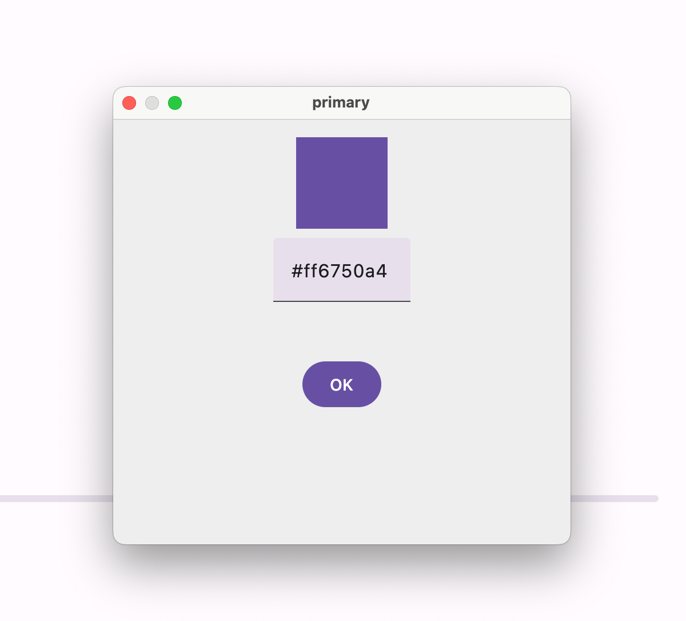

[](https://github.com/oas004/Material3Playground/actions/workflows/verification.yml)

# Material3Playground
Desktop Playground to check how changing the color system can affect the different components in Material 3. Mainly used to learn and to get an overview of the Material 3 design components.

## Setup 🔧

You want to check out the code, you can clone the project with 
```
git clone git@github.com:oas004/Material3Playground.git
```
Make sure that you are running a JDK version higher than 15. You can run the application either by running 
```
./gradlew run
```
or pressing the play gutter icon button in the `Main.kt` file.

## Gameplay 🔥

### UI Mode

You can toggle the UI Mode in the window menu bar at the top left. This will update all the colors to the dark/light theme.

| Light Mode                                                |                        Dark Mode                        | 
|-----------------------------------------------------------|:-------------------------------------------------------:|
|  |  |

You can interact with the components as you would on a mobile application. However, note that this is build with compose for desktop and there will be some differences on mobile.

### Interaction 🌻
You can interact with the colors on the right side. If you press a color, you can change the hexcode for this color. Pressing the "OK" button will update the components with the new color.



For instance changing the primary color to pink will update the main display with pink as primary color like this:


The second time you change this color, the pink color will be remembered as a recently used color.


## Upcoming features 👷
 - We are still missing some key components from Material 3. We are planing on adding them. If there are someone that you miss, please file an issue or even better; make a PR on it.

## Contribution ❄️ ⚡
Pull requests are welcome! We'd love help improving this library. Feel free to browse through open issues to look for things that need work. If you have a feature request or bug, please open a new issue so we can track it.

## License
MIT License

Copyright (c) 2024 Odin Asbjørnsen

Permission is hereby granted, free of charge, to any person obtaining a copy
of this software and associated documentation files (the "Software"), to deal
in the Software without restriction, including without limitation the rights
to use, copy, modify, merge, publish, distribute, sublicense, and/or sell
copies of the Software, and to permit persons to whom the Software is
furnished to do so, subject to the following conditions:

The above copyright notice and this permission notice shall be included in all
copies or substantial portions of the Software.

THE SOFTWARE IS PROVIDED "AS IS", WITHOUT WARRANTY OF ANY KIND, EXPRESS OR
IMPLIED, INCLUDING BUT NOT LIMITED TO THE WARRANTIES OF MERCHANTABILITY,
FITNESS FOR A PARTICULAR PURPOSE AND NONINFRINGEMENT. IN NO EVENT SHALL THE
AUTHORS OR COPYRIGHT HOLDERS BE LIABLE FOR ANY CLAIM, DAMAGES OR OTHER
LIABILITY, WHETHER IN AN ACTION OF CONTRACT, TORT OR OTHERWISE, ARISING FROM,
OUT OF OR IN CONNECTION WITH THE SOFTWARE OR THE USE OR OTHER DEALINGS IN THE
SOFTWARE.
